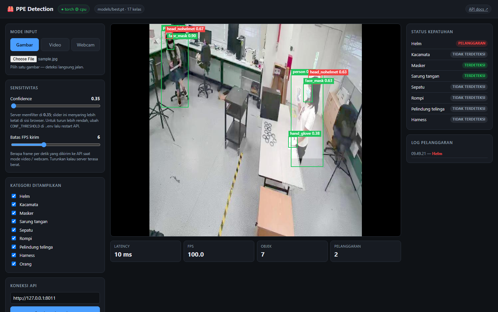
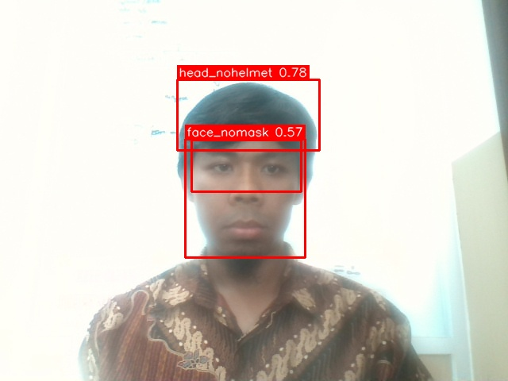

# 🦺 PPE Detection — YOLOv8 + FastAPI + Streamlit

Sistem deteksi Alat Pelindung Diri (APD/PPE) berbasis **YOLOv8** dengan
pipeline lengkap: inference lokal (image / video / webcam), REST API via
**FastAPI**, frontend web satu file, dan demo UI via **Streamlit**. Siap
dijalankan lewat Docker.

Dibangun sebagai **tugas akhir sertifikasi AI Super Class — track Computer
Vision**, melanjutkan proyek PPE Detection sebelumnya yang berbasis Roboflow
Serverless Inference API menjadi solusi yang **offline-capable** dan siap
diintegrasikan ke perangkat edge (CCTV / dashcam armada).

## ⚡ Mulai cepat

```bash
git clone <repo> && cd "PPE Detection"
python -m venv venv && venv\Scripts\activate     # Linux/Mac: source venv/bin/activate
pip install -r requirements.txt

# Taruh weights di models/best.pt (tidak ikut di-commit — lihat Setup langkah 3)

uvicorn app.api:app --port 8000
```

Buka **http://localhost:8000** — frontend demo, Swagger di `/docs`.



---

## 🧠 Modul tambahan: Deteksi Fatigue & Absensi Wajah

Dari aliran CCTV yang sama, modul kedua menjawab dua pertanyaan yang tidak bisa
dijawab deteksi APD: **siapa yang ada di sini**, dan **bagaimana kondisinya**.

- **Absensi face recognition** — YuNet + SFace lewat `cv2` yang sudah ada (nol
  dependency baru), database SQLite offline, pendaftaran banyak foto per orang.
- **Deteksi fatigue** — CNN penampakan wajah (dilatih dari dataset Kaggle)
  **digabung** dengan sinyal perilaku temporal: PERCLOS, microsleep, laju kedip,
  menguap, dan kepala terkulai — dengan kalibrasi ambang mata per orang.

Kelelahan bukan properti satu frame: orang yang berkedip dan orang yang
tertidur terlihat identik dalam satu gambar diam. Karena itu keluaran CNN tidak
pernah dipakai sendirian.

```bash
pip install --no-deps mediapipe==1.0.1 && pip install "absl-py>=2.0" "sounddevice~=0.5"
python -m src.fatigue.assets              # unduh bobot wajah (41 MB, sha256-verified)
python scripts/prepare_fatigue_dataset.py # dataset: crop wajah + split per identitas
python scripts/train_fatigue.py           # latih classifier
python scripts/enroll_faces.py --webcam --id EMP001 --name "Budi Santoso"
python -m src.fatigue.cli webcam          # jalankan
```

Di Streamlit, pilih **Fatigue & absensi** di sidebar. Di FastAPI, endpoint-nya
ada di `/fatigue/*`.

📖 **Dokumentasi lengkap: [`docs/FATIGUE.md`](docs/FATIGUE.md)** — termasuk
metodologi split per identitas (yang menutup kebocoran 32% pada split acak
biasa), cara sistem memutuskan level, dan batasan yang perlu diketahui sebelum
dipakai.

⌨️ **Perintah siap-tempel: [`docs/PERINTAH_FATIGUE.md`](docs/PERINTAH_FATIGUE.md)**
— setup, UI, CLI, API, pendaftaran wajah, training ulang, dan troubleshooting.

---

## 📌 Latar Belakang

Kepatuhan penggunaan APD di lingkungan kerja industri (tambang, konstruksi,
logistik, transportasi) adalah salah satu indikator utama Keselamatan &
Kesehatan Kerja (K3). Pengawasan manual tidak scalable, sehingga otomasi
berbasis Computer Vision menjadi solusi natural.

Proyek ini merupakan **evolusi** dari iterasi pertama saya yang memakai
Roboflow Serverless Inference (butuh koneksi internet & API call per frame),
menjadi arsitektur yang:

- **Inference lokal** (Ultralytics YOLOv8 `.pt`) — tidak bergantung API online.
- Punya **layer API** untuk integrasi ke sistem lain (dashboard armada,
  event logger, telegram bot alert, dll).
- Punya **UI demo** untuk validasi cepat & presentasi hasil ke stakeholder.
- **Container-ready** untuk deployment ke perangkat lapangan.

---

## 🎯 Class yang Dideteksi

Dataset: Roboflow `wishnus-workspace/ppe-detection-hyeuz-6cijw` **version 2** —
**17 kelas mentah**, yang dipetakan sistem menjadi **8 kategori kepatuhan**.

| Kategori kepatuhan | Label positif (model) | Label pelanggaran (model) |
|--------------------|-----------------------|----------------------------|
| helmet         | `head_helmet`     | `head_nohelmet`     |
| glasses        | `glasses`         | `No_Glasses`        |
| mask           | `face_mask`       | `face_nomask`       |
| glove          | `hand_glove`      | `hand_noglove`      |
| shoes          | `shoes`, `boots`  | `Barefoots`, `Sandals` |
| vest           | `vest`            | — (tidak ada di dataset) |
| ear_protection | `Ear-protection`  | `No_Ear-Protection` |
| harness        | `Harness`         | — (tidak ada di dataset) |

Kelas ke-17 adalah `person`, ikut terdeteksi tapi bukan APD sehingga tidak
masuk perhitungan compliance.

Pemetaan ini ada di `RAW_LABEL_MAP` pada `src/detector.py`. Setiap deteksi
mengembalikan `label` (mentah) **dan** `category` (kategori kepatuhan).
Status per kategori: ✅ **TERDETEKSI** / ⚠️ **PELANGGARAN** / ⚪ **TIDAK
TERDETEKSI**. Deteksi pelanggaran digambar dengan bounding box merah.

> Catatan: `vest` dan `harness` tidak punya label negatif di dataset ini,
> jadi keduanya tidak akan pernah berstatus PELANGGARAN — hanya
> TERDETEKSI / TIDAK TERDETEKSI.

### Metrics

Ada dua angka yang jangan sampai tertukar — keduanya melatih arsitektur dan
data yang berbeda:

| | Roboflow Train v2 | Training lokal (`models/best.pt`) |
|---|---|---|
| mAP@50 | **86.3%** | **65.5%** |
| mAP@50-95 | — | **38.9%** |
| Precision | **83.0%** | **67.6%** |
| Recall | **84.6%** | **62.8%** |
| Dievaluasi pada | — | split **test**, 948 gambar |
| Data train | 19.890 gambar | 2.500 gambar (subset) |
| Resolusi | — | 416 px |
| Epochs | — | 20 |
| Hardware | GPU (cloud Roboflow) | CPU 12th Gen i7-1265U, ~4 jam |

Angka Roboflow lebih tinggi karena dilatih di **dataset penuh** dengan GPU.
Model lokal sengaja dilatih pada subset 2.500 gambar supaya bisa selesai di
CPU dalam hitungan jam — tujuannya membuktikan pipeline-nya utuh dan
menghasilkan `.pt` yang bisa di-export ke OpenVINO, bukan mengejar SOTA.
**Untuk produksi, latih ulang di GPU dengan dataset penuh.**

Per-kelas (mAP@50 pada split validasi saat training), model lokal sudah kuat
di objek besar dan kontras
(`boots` 0.905 · `Barefoots` 0.905 · `person` 0.881 · `vest` 0.858) tapi
lemah di kelas negatif yang objeknya kecil dan ambigu
(`hand_noglove` 0.255 · `No_Ear-Protection` 0.310 · `No_Glasses` 0.411).
Pola ini masuk akal: "tangan tanpa sarung tangan" secara visual hanyalah
tangan biasa, jadi modelnya butuh jauh lebih banyak contoh daripada yang ada
di subset. Rincian lengkap ada di `runs/ppe/ppe-yolov8n-cpu/`.

---

## 🏗️ Arsitektur Sistem

```
┌─────────────────┐    ┌────────────────────┐    ┌─────────────────┐
│  Input          │    │  Inference Engine  │    │  Output         │
│  ─────────      │    │  ────────────────  │    │  ─────────      │
│  • Image file   │───▶│  torch │ openvino  │───▶│  • Annotated    │
│  • Video file   │    │  int8  │ roboflow  │    │    image/video  │
│  • Webcam RTSP  │    │  ── build_detector │    │  • JSON         │
│  • HTTP upload  │    │  + compliance      │    │    (bbox, conf) │
│                 │    │    logic           │    │  • Compliance   │
└─────────────────┘    └─────────┬──────────┘    │    per class    │
                                 │               └────────┬────────┘
                       ┌─────────┴──────────┐             │
                       │  Delivery layer    │             │
                       │  ────────────────  │             │
                       │  FastAPI  (REST)   │◀────────────┘
                       │   └─ web/ (HTML)   │
                       │  Streamlit (UI)    │
                       │  CLI      (local)  │
                       └────────────────────┘
```

Ada **dua** frontend, sengaja berbeda peran:

| | `web/index.html` | `app/streamlit_app.py` |
|---|---|---|
| Dipakai untuk | demo publik, embed, deploy | operator / tuning harian |
| Inference | lewat HTTP ke `/predict` | panggil detector langsung di proses yang sama |
| Dependency | tidak ada — satu file, vanilla JS | Streamlit |
| Webcam | kamera **browser** (jalan dari mana saja) | kamera **mesin server** + snapshot browser |
| Kelebihan | ringan, bisa di-deploy satu container, tidak butuh Python di sisi klien | kontrol jauh lebih dalam: ambang per kategori, kebijakan alarm, profil, rekam sesi |

Keduanya berbagi taksonomi & logika compliance yang sama di `src/detector.py`,
jadi hasil deteksinya identik untuk gambar yang sama.

**Modul utama:**

```
PPE Detection/
├── src/
│   ├── detector.py       # PPEDetector (load YOLOv8, predict, render, filter kategori)
│   ├── openvino_detector.py # Backend OpenVINO IR (FP32/INT8), interface sama
│   ├── remote.py         # RoboflowDetector — backend serverless, interface sama
│   ├── backends.py       # build_detector() — pemilih backend untuk CLI/API/UI
│   ├── alerts.py         # AlertEngine (debounce, cooldown) + SessionStats + CSV
│   └── cli.py            # CLI: python -m src.cli image|video|webcam
├── app/
│   ├── api.py            # FastAPI: /health, /predict, /predict/image + serve web/
│   └── streamlit_app.py  # Streamlit UI: sensitivitas, alert, log, rekam sesi
├── web/
│   └── index.html        # Frontend demo: satu file, vanilla JS, tanpa dependency
├── tests/
│   ├── test_detector.py  # taksonomi label & logika compliance
│   ├── test_alerts.py    # debounce, cooldown, gating alarm
│   ├── test_backends.py  # pemilihan backend + letterbox/NMS OpenVINO
│   └── browser/
│       ├── selftest.html    # skenario uji yang dijalankan di dalam browser
│       └── run_selftest.py  # runner Chrome headless untuk web/index.html
├── scripts/
│   ├── download_dataset.py # Download dataset YOLOv8 dari Roboflow
│   ├── train.py            # Training lokal -> models/best.pt
│   ├── export_openvino.py  # .pt -> OpenVINO IR (FP32 + INT8 terkuantisasi)
│   ├── benchmark.py        # Ukur latency/FPS tiap backend -> docs/BENCHMARK.md
│   └── evaluate.py         # Ukur mAP tiap varian model  -> docs/METRICS.md
├── datasets/             # (dataset hasil export, tidak di-commit)
├── models/               # best.pt + IR INT8 ikut di-commit; FP32 & checkpoint tidak
├── main.py               # ⚠️ skrip awal (Roboflow serverless, model lama
│                         #    `ppes-kaxsi/8`). Sudah digantikan src/cli.py —
│                         #    disimpan sebagai jejak iterasi, jangan dipakai.
├── Dockerfile
├── docker-compose.yml    # Service: api (8000) + ui (8501)
├── requirements.txt
└── .env.example
```

> **Model ikut di repo.** `models/best.pt` (6,2 MB) dan IR OpenVINO INT8
> (3,5 MB) sengaja dikecualikan dari aturan `.gitignore`, jadi `git clone` →
> `pip install` → `uvicorn` langsung jalan tanpa training. Yang tetap tidak
> di-commit: `yolov8n.pt`, checkpoint training, dan IR FP32 (12 MB, bisa
> diregenerasi dengan `scripts/export_openvino.py --no-int8`).

---

## ⚙️ Setup & Install

### 1. Clone & buat virtualenv

```bash
git clone <repo-url>
cd "PPE Detection"

python -m venv venv
# Windows
venv\Scripts\activate
# Linux/Mac
source venv/bin/activate

pip install -r requirements.txt
```

### 2. Konfigurasi environment

```bash
cp .env.example .env
# edit .env, isi ROBOFLOW_API_KEY
```

Variabel yang paling sering diubah:

| Variable | Default | Fungsi |
|----------|---------|--------|
| `INFERENCE_BACKEND` | `torch` | Backend default untuk FastAPI (`torch` / `openvino` / `openvino-int8` / `roboflow`) |
| `OPENVINO_DEVICE` | `CPU` | Device OpenVINO: `CPU`, `GPU` (iGPU Intel), `AUTO` |
| `OPENVINO_MODEL_DIR` | auto | Override lokasi folder IR |
| `MODEL_PATH` | `models/best.pt` | Weights untuk backend `torch` |
| `CONF_THRESHOLD` / `IOU_THRESHOLD` | `0.35` / `0.45` | Threshold deteksi & NMS |
| `ROBOFLOW_API_KEY` | — | Wajib untuk download dataset & backend `roboflow` |

> ⚠️ Jangan menamai variabel endpoint FastAPI sebagai `API_URL`. SDK
> `roboflow` membaca env var bernama `API_URL` sebagai base URL-nya sendiri,
> sehingga download dataset akan gagal connect. Project ini memakai
> `PPE_API_URL`.

### 3. Siapkan weights `models/best.pt`

> ⚠️ **Roboflow tidak menyediakan download file `.pt`** untuk model yang
> dilatih di platform mereka (Roboflow Train). Yang bisa diunduh adalah
> datasetnya. Jadi untuk inference offline, weights harus dilatih sendiri.

```bash
# 1) Ambil dataset (format YOLOv8) — ~22.7k gambar
python scripts/download_dataset.py

# 2) Latih. Dataset penuh praktis butuh GPU.
python scripts/train.py --epochs 50 --imgsz 640 --batch 16
# → runs/ppe/<name>/weights/best.pt, otomatis disalin ke models/best.pt
```

Smoke test cepat di CPU (bukan untuk produksi, hanya memvalidasi pipeline):

```bash
python scripts/train.py --epochs 3 --imgsz 320 --batch 8 --subset 300
```

**Perkiraan waktu training** (diukur di mesin CPU 12-core, tanpa CUDA):
~4 gambar/detik pada imgsz 320. Artinya dataset penuh ≈ 80 menit *per epoch*
di 320px, dan jauh lebih lama di 640px — training penuh di CPU tidak realistis.
Gunakan GPU (Google Colab / RunPod / mesin ber-CUDA) untuk run yang sebenarnya.

Kalau kamu sudah punya file `.pt` sendiri, cukup taruh di `models/best.pt`
(atau override lewat env `MODEL_PATH`) dan lewati langkah training.

### 4. Export ke OpenVINO (disarankan untuk deployment CPU/edge)

```bash
python scripts/export_openvino.py
# FP32 saja, tanpa perlu dataset kalibrasi:
python scripts/export_openvino.py --no-int8
```

Menghasilkan `models/best_openvino_model/` (FP32) dan
`models/best_int8_openvino_model/` (INT8). Lihat section berikutnya.

---

## ⚡ Backend Inference

Semua backend mewarisi interface `PPEDetector` yang sama, jadi CLI, FastAPI,
dan Streamlit tinggal memanggil `build_detector(...)` tanpa peduli mana yang
aktif. Pemilihnya ada di `src/backends.py`.

| Backend | Sumber model | Kapan dipakai |
|---------|--------------|---------------|
| `torch` (default) | `models/best.pt` | Referensi akurasi. Paling gampang — tidak butuh export. |
| `openvino` | `models/best_openvino_model/` | Deployment di CPU/iGPU Intel. Akurasi identik `.pt`, latency jauh lebih rendah. |
| `openvino-int8` | `models/best_int8_openvino_model/` | Edge box paling terbatas. Tercepat & paling kecil, dengan sedikit penurunan mAP. |
| `roboflow` | Serverless API | Baseline / saat weights lokal belum siap. Butuh internet. |

Alias lama tetap diterima: `local` dan `pytorch` → `torch`, `ov` → `openvino`,
`int8` → `openvino-int8`.

**Cara memilih:**

```bash
# CLI
python -m src.cli --backend openvino-int8 --device GPU image foto.jpg

# FastAPI (lewat environment)
INFERENCE_BACKEND=openvino uvicorn app.api:app --port 8000

# Streamlit → pilih di sidebar "Backend inference" + "Device OpenVINO"
```

`--device` hanya berlaku untuk backend OpenVINO: `CPU` (default), `GPU`
(iGPU Intel Iris Xe / UHD), atau `AUTO`.

### Kenapa INT8?

Quantization INT8 mengubah bobot & aktivasi dari float32 ke integer 8-bit.
Modelnya jadi ~4x lebih kecil dan jauh lebih cepat di CPU, tapi ada trade-off
akurasi. Prosesnya butuh **data kalibrasi** — NNCF menjalankan beberapa ratus
gambar dari split `val` untuk mengukur rentang aktivasi tiap layer — makanya
`export_openvino.py` menolak jalan kalau dataset belum di-download.

### Hasil benchmark

Diukur di **Intel Core i7-1265U** (12 core, tanpa GPU diskrit), model 416 px,
10 gambar berbeda × 50 iterasi. Latency = **end-to-end per frame**
(preprocess + inference + NMS + mapping ke objek `Detection`), bukan hanya
forward pass — karena itulah yang menentukan FPS sebenarnya di stream kamera.

| Backend | Device | Mean (ms) | p95 (ms) | FPS | Speedup |
|---------|--------|-----------|----------|-----|---------|
| `torch` | CPU | 155.8 | 233.7 | 6.4 | 1.00× |
| `openvino` | CPU | 84.4 | 135.1 | 11.8 | 1.85× |
| `openvino` | **GPU** | 22.9 | 33.3 | 43.7 | **6.81×** |
| `openvino-int8` | CPU | 70.0 | 149.3 | 14.3 | 2.22× |
| `openvino-int8` | **GPU** | 18.2 | 22.2 | **54.9** | **8.55×** |

Tiga hal yang menarik dari angka ini:

1. **iGPU-nya jauh lebih berpengaruh daripada quantization.** Pindah dari CPU
   ke iGPU Intel memberi ~3,7× — jauh lebih besar daripada lompatan FP32→INT8
   di CPU (~1,2×). Intel Iris Xe yang selama ini menganggur ternyata mesin
   inference yang layak.
2. **INT8 di CPU justru paling tidak stabil.** Mean-nya turun ke 70 ms, tapi
   p95-nya 149 ms — lebih buruk daripada FP32 CPU (135 ms). Untuk stream
   realtime, latency ekor seperti ini terasa sebagai frame drop yang tersendat.
   Di GPU sebaliknya: p95 22,2 ms, paling konsisten dari semuanya.
3. **Ukuran model turun 3,4×** — 11,7 MB (FP32) → 3,4 MB (INT8), relevan untuk
   edge box dengan storage terbatas.

### Berapa akurasi yang hilang?

Kecepatan tidak ada artinya kalau modelnya jadi bodoh. Diukur di **split test
yang belum pernah dilihat model** (948 gambar, 416 px):

| Varian | mAP@50 | mAP@50-95 | Precision | Recall | Δ mAP@50 |
|--------|--------|-----------|-----------|--------|----------|
| PyTorch FP32 | 0.6545 | 0.3886 | 0.6756 | 0.6282 | — |
| OpenVINO FP32 | 0.6547 | 0.3845 | 0.6682 | 0.6277 | **+0.02 pp** |
| OpenVINO INT8 | 0.6513 | 0.3820 | 0.6636 | 0.6298 | **−0.32 pp** |

- **OpenVINO FP32 secara efektif identik dengan PyTorch** (selisih +0.02 pp
  adalah noise pembulatan, bukan perbaikan nyata). Ini yang diharapkan — FP32
  hanya mengubah cara model dieksekusi, bukan bobotnya.
- **INT8 hanya membayar 0,32 poin mAP@50** untuk 8,55× kecepatan. Recall-nya
  bahkan sedikit lebih tinggi (0.6298 vs 0.6282); yang turun adalah precision,
  artinya INT8 sedikit lebih "berani" menghasilkan deteksi.

Untuk deteksi APD, trade-off ini menguntungkan: **melewatkan** pekerja tanpa
helm jauh lebih mahal daripada satu false positive yang bisa diverifikasi
supervisor.

**Rekomendasi:** `openvino-int8 @ GPU` untuk deployment (tercepat, p95 paling
konsisten, biaya akurasi 0,32 pp), `torch` saat development karena tidak butuh
export ulang tiap kali weights berubah.

Angka lengkap: [`docs/BENCHMARK.md`](docs/BENCHMARK.md) (`python scripts/benchmark.py`)
· [`docs/METRICS.md`](docs/METRICS.md) (`python scripts/evaluate.py`)

---

## 🚀 Menjalankan

### CLI (local)

```bash
# Satu gambar
python -m src.cli image path/to/foto.jpg

# Video file
python -m src.cli video path/to/video.mp4

# Webcam realtime (tekan 'q' berhenti, 's' snapshot)
python -m src.cli webcam --index 0 --save outputs/webcam_demo.mp4
```

Flag global:

| Flag | Fungsi |
|------|--------|
| `--backend torch` (default) | Inference offline pakai `models/best.pt` (alias: `local`) |
| `--backend openvino` / `openvino-int8` | Inference lewat OpenVINO IR — jauh lebih cepat di CPU/iGPU Intel |
| `--backend roboflow` | Inference via Roboflow Serverless (butuh internet) — berguna sebagai baseline atau saat weights lokal belum siap |
| `--device CPU\|GPU\|AUTO` | Hanya untuk backend OpenVINO. `GPU` = iGPU Intel |
| `--conf 0.4` | Confidence threshold |
| `--categories helmet,vest` | Hanya deteksi kategori tertentu; sisanya dibuang dari box, tabel, dan compliance |

Contoh — abaikan sarung tangan dan orang:

```bash
python -m src.cli --categories helmet,glasses,mask,shoes,vest,ear_protection,harness image foto.jpg
```

### FastAPI service

```bash
uvicorn app.api:app --reload --port 8000
```

Endpoints:

| Method | Path             | Deskripsi                                                    |
|--------|------------------|--------------------------------------------------------------|
| GET    | `/`              | Frontend demo (`web/index.html`) |
| GET    | `/health`        | Health check + info model (backend aktif, device, path, jumlah class, list class, ambang confidence & IoU, daftar kategori APD) |
| POST   | `/predict`       | Multipart upload gambar → JSON `{detections, compliance, annotated_image_b64}` |
| POST   | `/predict?annotate=false` | Sama, **tanpa** `annotated_image_b64`. Untuk mode realtime — client menggambar box sendiri dari koordinat bbox. |
| POST   | `/predict/image` | Multipart upload gambar → langsung return PNG hasil deteksi |

Dokumentasi interaktif: **http://localhost:8000/docs**

Contoh request:

```bash
curl -X POST -F "file=@sample.jpg" http://localhost:8000/predict | jq .compliance
```

**Kenapa ada `annotate=false`.** Pada gambar uji 640×640, response lengkap
dengan PNG teranotasi berukuran **819.914 byte**; tanpa itu hanya **1.009 byte**
— **99,9% lebih kecil**. Di mode webcam, encode PNG + transfer base64 tiap
frame jauh lebih mahal daripada inference-nya sendiri, jadi frontend memakai
mode ini dan menggambar bounding box di `<canvas>` dari koordinat yang
dikembalikan. Endpoint default tetap mengirim gambar supaya `curl` satu baris
tetap enak dipakai.

Contoh response `/predict` (dipotong):

```json
{
  "width": 640,
  "height": 480,
  "compliance": {
    "helmet": "PELANGGARAN",
    "vest": "TERDETEKSI",
    "mask": "TIDAK TERDETEKSI"
  },
  "detections": [
    {
      "label": "head_nohelmet",
      "category": "helmet",
      "confidence": 0.7836,
      "bbox": [223, 100, 402, 189],
      "is_violation": true
    }
  ],
  "annotated_image_b64": "iVBORw0KGgo..."
}
```

`label` = kelas mentah model, `category` = kategori kepatuhan hasil pemetaan.

### Frontend web (satu file HTML)

Tidak ada langkah build, tidak ada `npm install`. Begitu FastAPI jalan,
frontend sudah ikut dilayani di root:

```bash
uvicorn app.api:app --port 8000
# buka http://localhost:8000
```


Tiga mode input, semuanya menggambar bounding box sebagai overlay di `<canvas>`:

| Mode | Cara kerja |
|------|------------|
| **Gambar** | File dikirim **apa adanya** ke `/predict`. Sengaja tidak di-resize/re-encode supaya hasilnya identik dengan `python -m src.cli image <file>` — pernah ada versi yang re-encode JPEG di browser dan diam-diam menghilangkan deteksi lemah (`hand_glove` 0.38), sehingga UI dan CLI memberi jawaban berbeda untuk gambar yang sama. |
| **Video** | Video diputar di browser, frame diambil berkala lewat canvas lalu dikirim ke API. Ada progress bar. |
| **Webcam** | `getUserMedia` — kamera **browser**, bukan kamera server. Artinya demo yang di-deploy ke cloud tetap bisa dipakai dari laptop/HP siapa pun. |

Kontrol yang tersedia:

- **Confidence** — menyaring ulang di sisi browser tanpa memanggil API lagi,
  jadi menggeser slider terasa instan. Batas bawahnya dikunci ke ambang server
  (`conf_threshold` dari `/health`): deteksi di bawah angka itu sudah dibuang
  model sebelum sempat dikirim, jadi slider yang bisa turun lebih rendah cuma
  akan berbohong. Untuk benar-benar menurunkannya, ubah `CONF_THRESHOLD` di
  `.env` lalu restart API.
- **Batas FPS kirim** — berapa frame per detik yang dikirim di mode video/webcam.
- **Kategori ditampilkan** — checkbox per kategori APD; ikut memfilter bounding
  box, kartu compliance, dan log sekaligus.
- **Koneksi API** — kalau file HTML-nya dibuka terpisah (mis. di-host di GitHub
  Pages), isi base URL API di sini. CORS sudah dibuka di `app/api.py`.

Panel kanan menampilkan status 8 kategori kepatuhan dan **log pelanggaran**
yang hanya mencatat saat status berubah patuh → melanggar, bukan tiap frame —
logika peredam yang sama dengan `src/alerts.py` di sisi Python.

> **Catatan webcam:** browser hanya mengizinkan `getUserMedia` di `localhost`
> atau HTTPS. Di `http://` dengan IP LAN (mis. `http://192.168.1.5:8000`),
> tombol kamera akan ditolak browser — ini aturan browser, bukan bug aplikasi.
> HuggingFace Spaces sudah HTTPS, jadi di sana webcam jalan.

Loop pengiriman frame menjaga **satu request in-flight** pada satu waktu: kalau
timer berbunyi sementara `/predict` sebelumnya belum menjawab, tick itu
dilewati. Tanpa penjaga ini, server yang lebih lambat dari batas FPS akan
menumpuk antrean dan overlay makin tertinggal dari gambar yang tampil.

### Streamlit demo UI

```bash
streamlit run app/streamlit_app.py
```

Buka **http://localhost:8501**. Sidebar dibagi lima panel:

**🧠 Model & backend** — OpenVINO INT8 / OpenVINO FP32 / PyTorch / Roboflow
serverless, plus *Device OpenVINO* (CPU / GPU iGPU Intel / AUTO) saat backend
OpenVINO dipilih. Detector di-cache per (backend, device) karena compile
OpenVINO makan beberapa detik dan Streamlit me-rerun script tiap interaksi.

**🎚️ Sensitivitas**

- **Preset** — 🟢 Longgar (0.20/0.50) · 🟡 Seimbang (0.35/0.45) · 🔴 Ketat
  (0.55/0.40). Menggeser slider manual otomatis mengubah preset jadi *Custom*.
- **Confidence** & **IoU/NMS threshold**.
- **Ambang khusus per kategori** — slider sendiri untuk tiap kategori. Ini
  yang paling berguna di model ini: kelas negatif berobjek kecil
  (`hand_noglove` mAP 0.26, `No_Glasses` 0.41) butuh ambang lebih rendah,
  sementara kelas kuat seperti `boots` bisa dinaikkan supaya tidak berisik.
  Model dijalankan pada ambang **terendah** di antara semua kategori
  (`detection_floor`), lalu tiap deteksi disaring dengan ambang kategorinya
  masing-masing — jadi menurunkan satu kategori tidak membuat kategori lain
  ikut ramai.

**👁️ Kategori yang dideteksi** — checkbox per kategori. Uncheck *Sarung
tangan*, misalnya, dan deteksi glove hilang dari bounding box, tabel detail,
dan kartu compliance sekaligus. Ada tombol *Pilih semua* / *Kosongkan*.

**🚨 Alert** — terpisah dari panel deteksi, karena "digambar & dicatat" tidak
harus berarti "dibunyikan alarm":

| Kontrol | Fungsi |
|---------|--------|
| Checkbox per kategori | Hanya kategori tercentang yang memicu alarm. Rompi & harness tidak muncul di sini — dataset tidak punya label pelanggarannya. |
| **Pelanggaran harus bertahan (frame)** | Peredam kedipan. Deteksi per-frame gampang berkelip (orang menoleh, frame buram); alarm baru bunyi setelah pelanggaran bertahan N frame berturut-turut. |
| **Cooldown per kategori** | Jeda minimum sebelum kategori yang sama boleh dialarmkan lagi — mencegah satu pelanggaran jadi ratusan baris log. |
| **Hanya alarm kalau ada orang di frame** | Meredam alarm dari helm/rompi yang tergeletak. Butuh kategori *Orang* aktif. |
| **Bunyikan suara** | Nada alarm dibangkitkan runtime (`st.audio(autoplay=True)`), tanpa file aset. |
| **Simpan snapshot bukti** | Frame teranotasi saat alarm disimpan ke `outputs/violations/`. |

**💾 Profil setting** — simpan seluruh kombinasi di atas dengan nama
(mis. *Gudang malam*, *Area las*) ke `config/ui_profiles.json`, lalu muat
lagi kapan pun. Berguna kalau satu instalasi dipakai untuk beberapa area
kerja dengan aturan APD berbeda.

Di area utama, tiap mode menampilkan **metrik sesi** (FPS, frame diproses,
% kepatuhan, jumlah alarm), **log pelanggaran** yang bisa diunduh sebagai
CSV, dan galeri **snapshot bukti** terakhir.

Per mode:

| Mode | Tambahan |
|------|----------|
| **Gambar** | Unduh gambar teranotasi (JPG) dan hasil mentah (JSON). Debounce dimatikan — satu gambar = satu kesempatan. |
| **Video** | Progress bar + preview berjalan, opsi *proses tiap N frame* untuk video panjang, unduh mp4 hasil. Kolom waktu di log memakai posisi **di dalam video** (mm:ss), dan cooldown dihitung pada jam video, bukan jam pemrosesan. |
| **Webcam → Realtime** | Kamera mesin yang menjalankan Streamlit. Kontrol *Camera index*, *Batas FPS*, *Cermin*, dan **⏺️ Rekam sesi ke mp4** → hasilnya bisa diunduh setelah Stop (tersimpan di `outputs/sessions/`). |
| **Webcam → Snapshot** | Kamera **browser** via `st.camera_input`, aman untuk deploy remote. |

> Filter kategori dan ambang per kategori diterapkan di layer detector
> (`enabled_categories`, `category_conf`), bukan hanya di UI — jadi CLI,
> REST API, dan UI berperilaku sama. Kebijakan alarm ada di `src/alerts.py`
> (`AlertEngine`), bebas Streamlit, jadi bisa dipakai ulang worker CCTV.

### Docker (semua sekaligus)

```bash
docker compose up --build
```

- API   → http://localhost:8000
- UI    → http://localhost:8501

`models/` dan `outputs/` di-mount sebagai volume, jadi weight tidak perlu
di-bake ke image dan hasil deteksi tetap persistent di host. Folder IR
OpenVINO ikut ter-mount lewat volume yang sama, jadi `INFERENCE_BACKEND=openvino`
di `.env` langsung berlaku di dalam container — tanpa rebuild image.

> Backend `openvino` di container hanya jalan di **CPU**. Akses iGPU Intel dari
> dalam container butuh passthrough `/dev/dri` + driver compute di image, yang
> belum disiapkan di sini. Untuk uji `--device GPU`, jalankan langsung di host.

---

## ☁️ Deploy

Image-nya melayani **API dan frontend dari satu container**, jadi demo publik
cukup satu service. Port diambil dari env `PORT` (default `8000`) supaya cocok
dengan platform yang menentukan portnya sendiri.

Tiga hal yang membedakan image deploy dari `docker compose` lokal:

1. **Weights di-bake ke image** (`COPY models ./models`). HuggingFace Spaces dan
   Railway tidak punya volume mount, jadi `models/best.pt` harus sudah ada di
   dalam image saat build. Di lokal, `docker compose` menimpanya dengan volume
   `./models`, jadi tidak ada duplikasi kerja.
2. **torch versi CPU** dipasang dari index PyTorch sebelum `requirements.txt`.
   Tanpa itu, PyPI memberi wheel CUDA ±2,5 GB yang tidak terpakai sama sekali.
   Terverifikasi di dalam image: `torch 2.13.0+cpu`, `torch.version.cuda = None`.
3. **User non-root UID 1000** (`useradd --uid 1000 appuser`) dengan `HOME`,
   `XDG_CACHE_HOME`, `MPLCONFIGDIR`, dan `YOLO_CONFIG_DIR` di bawahnya.
   HuggingFace menjalankan container sebagai UID 1000; tanpa home yang writable,
   Ultralytics, matplotlib, dan fontconfig sama-sama jatuh ke fallback dan
   membanjiri log (`is not writable`, `No writable cache directories`), plus
   font cache matplotlib dibangun ulang setiap start.

### HuggingFace Spaces

1. Buat Space baru → SDK **Docker** → Blank.
2. Model sudah ikut di repo (`models/best.pt` 6,2 MB + IR INT8 3,5 MB), jadi
   tidak ada langkah tambahan — cukup push. Total repo ~8,7 MB, tanpa Git LFS.
3. Tambahkan `README.md` di root Space dengan frontmatter ini (HuggingFace
   membaca `app_port` dari sini):

   ```yaml
   ---
   title: PPE Detection
   emoji: 🦺
   colorFrom: yellow
   colorTo: red
   sdk: docker
   app_port: 7860
   ---
   ```

4. Set variabel `PORT=7860` di **Settings → Variables**, lalu push.

CPU Basic (2 vCPU, gratis) cukup untuk mode gambar dan webcam pelan. Untuk
webcam yang lebih lancar, set `INFERENCE_BACKEND=openvino-int8` di Variables —
IR-nya sudah ikut di repo, jadi langsung berlaku setelah restart Space.

### Railway

```bash
railway init
railway up
```

Railway mendeteksi `Dockerfile` sendiri dan menyuntikkan `PORT`, jadi tidak ada
konfigurasi tambahan. Set `INFERENCE_BACKEND` di dashboard kalau ingin OpenVINO.

### Status verifikasi

Image sudah benar-benar di-build dan dijalankan, bukan sekadar ditulis:

| Yang diuji | Hasil |
|---|---|
| `docker build -t ppe-detection .` | sukses, tanpa warning |
| torch di dalam image | `2.13.0+cpu`, `cuda = None` — wheel CUDA tidak ikut |
| Container sebagai **UID 1000** (kondisi HF Spaces) | start bersih, tanpa warning permission |
| `INFERENCE_BACKEND=openvino-int8` di container | jalan, `models/best_int8_openvino_model/best.xml` @ CPU |
| `POST /predict` di container | 7 deteksi, 2 pelanggaran — **identik dengan hasil di host** |
| Latency di container (CPU, INT8) | median **125 ms** end-to-end termasuk HTTP |
| `docker compose up -d` | `ppe-api` healthy (healthcheck lulus) + `ppe-ui` jalan |
| Smoke test browser terhadap container | lulus penuh (lihat bagian Testing) |

> **Ukuran image: 4,22 GB.** Jalan, tapi gemuk. `site-packages` saja 2,4 GB, dan
> sebagian besar tidak dipakai API:
>
> | Paket | Ukuran | Dibutuhkan API? |
> |---|---|---|
> | `torch` + `sympy` | 834 MB | ya (inference) |
> | `openvino` | 176 MB | ya (backend INT8) |
> | `_polars_runtime_32` + `pyarrow` | 359 MB | tidak — ditarik Streamlit |
> | `scipy` + `sklearn` + `pandas` + `matplotlib` | 305 MB | sebagian besar dari `nncf` (export-only) |
> | `onnx` | 85 MB | tidak — hanya untuk *membuat* IR |
> | `cv2` + `opencv_python_headless.libs` | 232 MB | terpasang **dua kali**: `roboflow` menarik varian headless sementara `requirements.txt` memasang varian GUI |
>
> Kalau ukuran jadi masalah (build lambat di HF Spaces free tier), bikin
> `requirements-deploy.txt` tanpa `streamlit`, `nncf`, `onnx`, dan `roboflow`,
> lalu pakai `opencv-python-headless`. Backend `roboflow` tetap jalan — 
> `src/remote.py` memakai `requests` langsung, bukan SDK-nya. Yang hilang cuma
> service `ui` di compose dan `scripts/export_openvino.py`, yang keduanya
> memang tidak dipakai di container deploy.

---

## 🧪 Testing

```bash
pip install -r requirements-dev.txt
pytest tests -q
```

`tests/test_detector.py` menguji taksonomi label dan logika compliance
(termasuk aturan "satu pelanggaran mengalahkan deteksi positif") tanpa perlu
file `.pt`, jadi test tetap jalan di CI yang tidak punya weights.

`tests/test_alerts.py` menguji kebijakan alarm di `src/alerts.py` — debounce
N-frame berturut-turut (termasuk streak yang hangus saat pelanggaran hilang
sekejap), cooldown per kategori, pemilihan kategori yang dialarmkan, gating
"harus ada orang", isi event (confidence tertinggi), export CSV, dan
perhitungan `compliance_rate` pada `SessionStats`.

`tests/test_backends.py` menguji dua hal, juga tanpa perlu weights maupun
runtime OpenVINO:

1. **Pemilihan backend** — normalisasi nama & alias lama, penolakan nama tidak
   dikenal, pembacaan env `INFERENCE_BACKEND`, dan bahwa error "model belum
   di-export" menyebut cara memperbaikinya.
2. **Pre/post-processing OpenVINO** — `letterbox` (ukuran output, aspect ratio
   terjaga, roundtrip koordinat, warna padding) dan `nms` (supresi box
   bertumpuk, box terpisah, urutan skor, input kosong, efek threshold). Ini
   bagian yang ditulis manual karena OpenVINO tidak membawa post-processing
   YOLO seperti Ultralytics, jadi paling rawan salah.

### Smoke test frontend (browser sungguhan)

`pytest` tidak menyentuh `web/index.html` sama sekali. Untuk itu ada runner
terpisah yang menjalankan Chrome headless:

```bash
uvicorn app.api:app --port 8000          # terminal 1
python tests/browser/run_selftest.py     # terminal 2
```

Yang diperiksa — semuanya hal yang hanya bisa gagal di browser:

- halaman terhubung ke `/health` dan mengisi badge backend/model,
- file gambar yang dimasukkan ke `<input type=file>` benar-benar terkirim dan
  menghasilkan deteksi,
- **piksel canvas**: box merah (pelanggaran) dan hijau (patuh) benar-benar
  tergambar — bukan sekadar "tidak ada exception",
- slider confidence menyaring ulang tanpa memanggil API,
- mematikan satu kategori mengurangi jumlah objek,
- ganti tab gambar/video/webcam tidak melempar error,
- tidak ada `error` atau `unhandledrejection` selama seluruh skenario.

Runner menyalin `selftest.html` ke `web/` sementara (perlu origin yang sama
supaya iframe ke `/index.html` tidak kena same-origin policy) dan menghapusnya
lagi di akhir, sukses maupun gagal.

Hasil terakhir di mesin dev: **7 objek, 2 pelanggaran, 3.301 px merah,
7.748 px hijau — sama persis dengan output `/predict` untuk gambar yang sama.**

---

## 🩺 Troubleshooting

| Gejala | Sebab & solusi |
|--------|----------------|
| `download_dataset.py` gagal connect ke `localhost:8000` | Ada env var bernama `API_URL`. SDK roboflow memakainya sebagai base URL. Rename jadi `PPE_API_URL`. |
| `ModuleNotFoundError: No module named 'src'` saat `streamlit run` | Streamlit menaruh `app/` di `sys.path`, bukan root project. Sudah ditangani oleh bootstrap `PROJECT_ROOT` di `app/streamlit_app.py`. |
| `FileNotFoundError: Model tidak ditemukan di models/best.pt` | Weights belum ada. Jalankan `scripts/download_dataset.py` lalu `scripts/train.py`, atau taruh `.pt` sendiri di `models/`. |
| `401 Unauthorized api_key` dari Roboflow | `.env` tidak terbaca (python-dotenv mencari relatif ke lokasi file pemanggil). Jalankan script dari root project atau pakai `load_dotenv(PROJECT_ROOT / ".env")`. |
| `docker compose` error `dockerDesktopLinuxEngine ... cannot find the file` | Docker Desktop terpasang tapi engine belum jalan. Start Docker Desktop dulu. |
| Training di CPU sangat lambat | Normal. Pakai `--subset` untuk smoke test, dan GPU untuk training sungguhan. |
| Training terputus di tengah jalan | Jangan mulai dari nol. `python scripts/train.py --resume --name <nama-run>` melanjutkan dari `last.pt`, lengkap dengan state optimizer. |
| `FileNotFoundError` menyebut `export_openvino` | Backend OpenVINO dipilih tapi IR-nya belum di-export. Jalankan `python scripts/export_openvino.py`. |
| Export INT8 gagal: "butuh dataset kalibrasi" | Quantization perlu gambar nyata untuk mengukur rentang aktivasi. Download dataset dulu, atau pakai `--no-int8`. |
| `--device GPU` gagal / tidak terdeteksi | iGPU Intel butuh driver yang dikenali OpenVINO. Fallback ke `CPU` atau `AUTO`. |
| `ignoring corrupt image/label: labels mix segment and detection rows` | Sebagian anotasi dataset ini berformat segmentasi (polygon), bukan bounding box. Ultralytics melewatinya; ~1% gambar hilang dan training tetap jalan. |
| Buka `http://localhost:8000` malah dapat `{"detail":"Not Found"}` | Folder `web/` tidak ada, jadi mount static dilewati (`app/api.py` memeriksa `WEB_DIR.is_dir()`). Pastikan `web/index.html` ikut ter-clone / ter-COPY di Dockerfile. |
| Tombol webcam ditolak: "Tidak bisa mengakses kamera" | Browser hanya mengizinkan `getUserMedia` di `localhost` atau HTTPS. Akses lewat IP LAN via `http://` selalu ditolak — pakai `localhost`, atau deploy ke platform ber-HTTPS. |
| Frontend jalan tapi badge merah "API tidak terjangkau" | Halaman dibuka sebagai `file://` sementara API di port lain. Isi base URL yang benar di panel **Koneksi API**, atau akses lewat `http://localhost:8000` supaya satu origin. |
| Slider confidence tidak bisa turun di bawah 0.35 | Memang dikunci ke ambang server: deteksi di bawahnya sudah dibuang model. Turunkan `CONF_THRESHOLD` di `.env`, restart API, lalu refresh halaman. |
| Deteksi di mode webcam terasa tertinggal dari gambar | Turunkan **Batas FPS kirim**, atau pindah ke `INFERENCE_BACKEND=openvino-int8`. Loop sudah membatasi satu request in-flight, jadi ini murni soal server lebih lambat dari laju frame. |
| Mode video jauh lebih sedikit deteksinya dari mode gambar | Wajar. Frame video dikecilkan ke lebar 640 px dan di-encode JPEG q=0.8 sebelum dikirim, sementara mode gambar mengirim file asli. Deteksi berconfidence rendah paling dulu hilang. |
| `run_selftest.py`: "Chrome tidak ditemukan" | Beri path eksplisit: `python tests/browser/run_selftest.py --chrome "C:\Program Files\Google\Chrome\Application\chrome.exe"`. |
| Docker build menarik ±2,5 GB untuk torch | Langkah `pip install --index-url .../whl/cpu torch` terlewat atau versinya tidak cocok dengan pin di `requirements.txt`. Keduanya harus sama persis. Cek dengan `docker run --rm ppe-detection python -c "import torch; print(torch.version.cuda)"` — harus `None`. |
| Log container penuh `is not writable` / `No writable cache directories` | Container jalan sebagai UID yang tidak punya home writable. Dockerfile sudah membuat `appuser` UID 1000 dengan `HOME`, `XDG_CACHE_HOME`, `MPLCONFIGDIR`, `YOLO_CONFIG_DIR`; kalau kamu override `--user` ke UID lain, sediakan home yang writable untuk UID itu. |
| `docker exec ... ls /app/models` malah mencari path Windows | Git Bash/MSYS menerjemahkan `/app/...` jadi path Windows. Jalankan dengan `MSYS_NO_PATHCONV=1` di depannya, atau pakai PowerShell. |

---

## 📸 Screenshot / Demo

Contoh output renderer — tiga pelanggaran terdeteksi sekaligus
(`head_nohelmet`, `No_Glasses`, `face_nomask`), semuanya digambar merah:



Compliance status untuk frame di atas:

```json
{ "helmet": "PELANGGARAN", "glasses": "PELANGGARAN", "mask": "PELANGGARAN",
  "glove": "TIDAK TERDETEKSI", "shoes": "TIDAK TERDETEKSI",
  "vest": "TIDAK TERDETEKSI", "ear_protection": "TIDAK TERDETEKSI",
  "harness": "TIDAK TERDETEKSI" }
```

Frontend web (`web/index.html`) pada gambar uji dari split test — dua
`head_nohelmet` digambar merah, sisanya hijau, panel kanan merangkum status
8 kategori:


_Screenshot berikut menyusul — simpan di `docs/screenshots/` lalu tampilkan di sini._

| Mode | Screenshot |
|------|------------|
| Streamlit — Image detection | `docs/screenshots/ui_image.png` |
| Streamlit — Compliance card | `docs/screenshots/ui_compliance.png` |
| FastAPI Swagger UI | `docs/screenshots/api_swagger.png` |
| Webcam realtime | `docs/screenshots/webcam.gif` |

---

## 🗺️ Rencana Pengembangan Lanjutan

Roadmap ini terkait langsung dengan pekerjaan saya di bidang **fleet GPS &
dashcam**:

1. **Integrasi ke stream dashcam armada** — konsumsi RTSP/HLS dari kamera
   in-cabin & side-camera, deteksi kepatuhan APD driver/kernet secara realtime.
2. **Integrasi ke CCTV loading dock / warehouse** — batching di edge box
   (Jetson Nano / Orin) supaya bandwidth ke cloud minimal.
3. **Event & alert pipeline** — pelanggaran (`head_nohelmet`, `hand_noglove`, dst)
   dikirim ke dashboard fleet management + notifikasi Telegram/WA ke supervisor
   HSE.
4. **Historical reporting** — agregasi compliance rate per unit / per shift /
   per site untuk audit K3.
5. **Retraining berkala** — feedback loop: false positive/negative dari
   lapangan → labelling di Roboflow → auto-retrain via Roboflow Train / RunPod.
6. **On-device optimization** — ✅ **OpenVINO FP32 + INT8 sudah jalan** (lihat
   `docs/BENCHMARK.md`), yang langsung relevan untuk edge box berbasis Intel.
   Berikutnya: **ONNX / TensorRT / NCNN** untuk Jetson dan dashcam Android.
7. **Deteksi fatigue driver & absensi** — ✅ **sudah jalan** (lihat
   `docs/FATIGUE.md`). Untuk armada, ini justru pasangan alami deteksi APD:
   kamera in-cabin yang sama sekaligus mengukur PERCLOS dan microsleep driver,
   dan mengenali siapa yang sedang memegang kemudi. Berikutnya: kalibrasi
   ulang dengan data dari kamera in-cabin sendiri (dataset publik yang dipakai
   sekarang berisi foto internet, bukan frame dashcam), dan penggabungan
   event fatigue ke pipeline alert yang sama dengan pelanggaran APD.

---

## 🙏 Credits

- Dataset & training platform: [Roboflow](https://roboflow.com)
- Model architecture: [Ultralytics YOLOv8](https://github.com/ultralytics/ultralytics)
- Serving: [FastAPI](https://fastapi.tiangolo.com), [Streamlit](https://streamlit.io)
- Dibuat sebagai tugas akhir **AI Super Class — Computer Vision Track**
